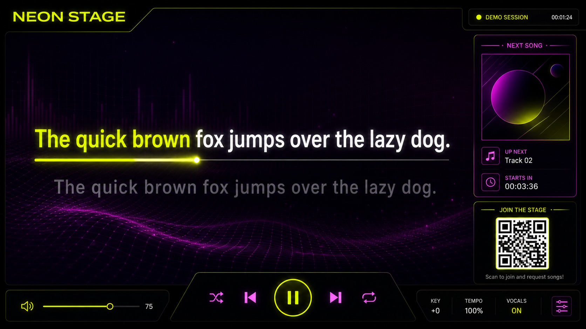
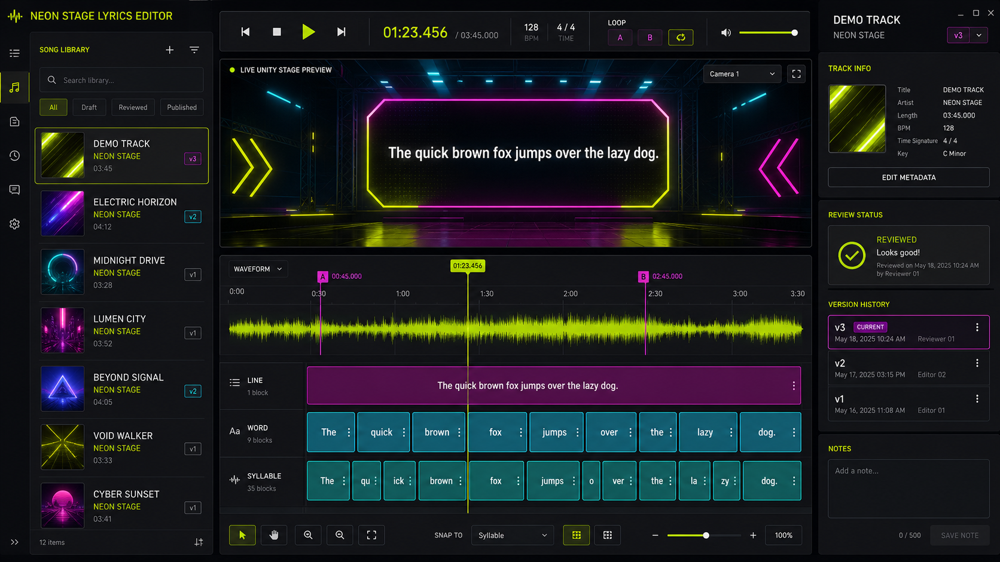

<div align="center">

# NEON STAGE

### Local-first karaoke that feels like a game

Unity stage · Mobile guest portal · Events · GPU lyrics alignment · Millisecond editor

</div>

Neon Stage is a self-hosted karaoke system. Guests join from an event QR code, search the released library, manage the queue, request missing tracks, and send live reactions to the singer. The Unity stage mixes instrumental and vocal stems and renders word- and syllable-timed lyrics. The desktop editor provides sample-stable playback and detailed manual review.

> Status: active development. This is not yet a polished end-user release.

> **Development disclosure:** A large part of Neon Stage has been created
> through AI-assisted “vibe coding”: the product direction, requirements,
> testing, and acceptance decisions are human-led, while substantial portions
> of implementation and documentation were produced collaboratively with AI
> coding tools. Contributions and careful technical review are very welcome.

If Neon Stage is useful to you and you would like to support its continued
development: [Support Neon Stage on Ko-fi](https://ko-fi.com/Z6Q023YEX5).

## Features

- Responsive guest and administration portals with planned events and ad-hoc sessions
- Shareable event links and QR codes
- Library search, queue management, requests, combined Spotify/Qobuz catalog search, and LRCLIB matching
- Font-independent heart, smile, thumbs-up, applause, and fire reactions
- Unity 6 stage for Linux and Android, including ARM32
- Synchronized instrumental/vocal playback with independent levels
- Word and optional syllable timing, lyric effects, reactive visuals, and transitions
- CUDA pipeline with source separation, ASR verification, forced alignment, candidate comparison, and quality gates
- Avalonia editor with waveform, stage preview, loops, undo/redo, cover import, UltraStar Deluxe TXT import, review states, portable single/multi-song packages, and per-song or full-library realignment
- German UI for German locales and English UI for other locales where supported

## Screens

These are real captures of the current Unity stage and Avalonia editor running
against an isolated synthetic demo library. The test audio was generated
locally, the cover uses project-owned artwork, and the only lyric-like text is
the pangram “The quick brown fox jumps over the lazy dog.” No real songs,
artist material, production library data, or real lyrics are shown.





## Architecture

```text
Guest phones ── HTTP/SSE ──▶ ASP.NET Core server ── state/audio ──▶ Unity stage
                                  │                                      │
                                  ├── SQLite events, queue and reviews    └── DSP audio + lyric FX
                                  ├── local media library
                                  └── CUDA alignment service ◀──────── Lyrics editor
```

| Component | Technology | Location |
|---|---|---|
| Server and web portals | ASP.NET Core / .NET 10 | `src/Karaoke.Server` |
| Stage | Unity 6 | `src/Karaoke.Stage.Unity` |
| Lyrics editor | Avalonia / .NET 10 | `src/Karaoke.App.Desktop` |
| Alignment service | Python, FastAPI, PyTorch, CUDA | `lyrics-word-aligner` |
| Lyrics matcher | .NET CLI | `LrcMatcher` |

## How server and clients work together

The ASP.NET Core server is the single source of truth. It owns event/session state, invitations, queue order, playback state, review metadata, and paths into the operator's local media library. Clients never ship with songs and do not need direct filesystem access.

1. **Create or activate a session.** An administrator prepares an event in the web portal, or the stage creates an ad-hoc session. The server returns an invitation token and QR code.
2. **Join from a phone.** A guest opens `/e/{invite-token}`. The responsive portal resolves that token through the server, stores only the guest's chosen display name locally, and queries the released song catalog.
3. **Build the queue.** Search, enqueue, reorder, remove, and request operations are HTTP calls scoped to the resolved event. Server-side validation prevents unreleased or incomplete songs from entering stage playback.
4. **Drive the stage.** The Unity client polls session/playback state and acquires the stage control lease. It requests metadata, cover art, enhanced lyrics, and audio/stem streams from the server. Instrumental and vocal files are decoded locally by Unity and synchronized against its DSP clock; lyric progress uses that same clock rather than network request timing.
5. **Send audience reactions.** Guest phones post a small reaction type (`heart`, `smile`, `like`, `clap`, or `fire`). The stage fetches the event's reaction stream and renders font-independent animated graphics. No emoji font is required on Android or Linux.
6. **Prepare new material.** The request worker downloads authorized source material, matches lyrics, and sends audio plus lyrics to the CUDA alignment container. Generated LRC, alignment diagnostics, and stems remain in the local library, outside application packages.
7. **Review and release.** The editor reads server metadata and local audio streams, caches temporary editing audio on the workstation, and saves versioned lyric documents back to the server. Re-alignment can target one song or the full library. Only an explicitly released version becomes visible to the Unity stage.
8. **Propagate changes.** Server-Sent Events notify portals and the editor about library and request changes. Incremental refreshes preserve the current editor selection and timeline work.

```text
Admin portal ── create/activate event ──┐
Guest portal ─ search/queue/react ─────┼──▶ Server API + SQLite + local library
Lyrics editor ─ review/release ────────┘                │
                                                       ├──▶ Unity stage (state, lyrics, covers, audio streams)
CUDA aligner ◀── jobs from server/scripts ──────────────┘
```

Network latency can delay a command reaching the stage, but it does not continuously drive lyric highlighting: after media is prepared, Unity derives audio and lyric position from its local synchronized playback clock.

## Quick start

Requirements: .NET 10, FFmpeg, LibVLC, Unity 6 for stage builds, Docker, and optionally NVIDIA Container Toolkit plus a CUDA GPU.

```bash
./scripts/linux/build.sh
./scripts/linux/start-server.sh /path/to/karaoke/library
./scripts/linux/start-desktop.sh http://127.0.0.1:5274
./scripts/linux/start-unity-stage.sh http://127.0.0.1:5274
```

Guest portal: `http://SERVER:5274/`  
Administration: `http://SERVER:5274/admin.html`

### Docker Compose server

The server image contains only application binaries and web assets. The media
library and SQLite state stay on the host as bind mounts.

```bash
cp .env.example .env
# Edit .env: library path, Spotify client ID/secret and the registered redirect URL
docker compose up -d --build server
docker compose ps
curl http://127.0.0.1:5274/api/health
```

`KARAOKE_LIBRARY_PATH` is mounted read/write at `/library`, while
`KARAOKE_DATA_PATH` stores the database and Spotify authorization token. The
secret `.env` file is ignored by Git. Set `LRC_ALIGNER_URL` to
`http://host.docker.internal:8081` when using the separately published CUDA
aligner on the same Linux host. The editor connects by setting
`KARAOKE_SERVER=http://SERVER:5274`.

This is intentionally the server-only deployment: library editing, events,
queues, wishes, web portals, playback coordination, and Spotify catalog access
run in the container. GPU alignment, MP3-folder ingestion, and request download
processing remain host/worker jobs because their CUDA models and downloader
toolchains are not release payloads. Run the documented worker scripts against
the container URL when those operations are needed.

### Configure Spotify Web API access

Spotify integration is optional, but it is not anonymous. Search uses Spotify's
official Web API with an application access token, while connecting the
operator's account uses Authorization Code flow with the
`playlist-modify-private` scope to maintain the private Neon Stage request
playlist. You must supply a Client ID, Client Secret, and registered Redirect
URI to the server.

1. Sign in to the [Spotify for Developers Dashboard](https://developer.spotify.com/dashboard).
2. Choose **Create app**, enter an app name and description, accept Spotify's
   Developer Terms, and create the app.
3. Open the app's settings and add this development Redirect URI exactly:

   ```text
   http://127.0.0.1:5274/api/spotify/callback
   ```

   Spotify requires an exact match. For plain HTTP it permits explicit
   loopback addresses such as `127.0.0.1`; `localhost` is not accepted. For a
   remotely hosted server, register the actual HTTPS callback instead, for
   example `https://karaoke.example.com/api/spotify/callback`.
4. Copy the app's Client ID and Client Secret into the untracked root `.env`:

   ```dotenv
   SPOTIFY_CLIENT_ID=
   SPOTIFY_CLIENT_SECRET=
   SPOTIFY_REDIRECT_URI=http://127.0.0.1:5274/api/spotify/callback
   ```

5. Restart the server. On the server computer, open
   `http://127.0.0.1:5274/` and choose **Connect Spotify** once. The callback
   exchanges the authorization code server-side and stores the resulting token
   below `KARAOKE_DATA_PATH`, never in a client application.

Keep the Client Secret and the generated `spotify-connection.json` private.
Never put either value into Unity, the mobile portal, a Docker image, logs, or
Git. Spotify apps start in Development Mode and remain subject to Spotify's
current user and quota restrictions. See Spotify's official
[app registration](https://developer.spotify.com/documentation/web-api/concepts/apps),
[Redirect URI](https://developer.spotify.com/documentation/web-api/concepts/redirect_uri),
and [Authorization Code](https://developer.spotify.com/documentation/web-api/tutorials/code-flow)
documentation.

### Optional Qobuz purchase-download provider

Qobuz can replace the YouTube/Sunnify download step when an official Qobuz
integration is configured. The combined request search marks every result as
Spotify or Qobuz; Qobuz results also show the catalog price and maximum audio
quality when those fields are returned by the account's API response. Directly
selected Qobuz results retain their catalog track ID through the worker. Prices
are informational: Neon Stage never purchases a track automatically.

Configure the plugin in **Management → Configure download provider…** in the
Lyrics Editor, or provide `QOBUZ_*` values in the untracked `.env`. Qobuz API
integration access is not an anonymous public credential: contact
[`api@qobuz.com`](mailto:api@qobuz.com) for the current partner onboarding and
documentation. Neon Stage needs an App ID, App Secret, and authorized User Auth
Token; it never asks for or stores a Qobuz account password.

The default format is lossless CD-quality FLAC. Matcher, aligner, library, and
stage consume FLAC directly, while MP3 320 and Hi-Res FLAC remain selectable.
The provider requests only Qobuz `intent=download` URLs authorized for the
configured account. It does not turn subscription streams into library files,
extract application keys, or bypass purchase entitlements. If Qobuz rejects a
download, the request remains open and is not silently routed to YouTube.
The Editor writes secrets only when it reaches the server on the same host or
through HTTPS; remote plain-HTTP configuration is rejected.

See [`docs/wishlist-worker.md`](docs/wishlist-worker.md) for worker and security
details. Qobuz currently documents normal file downloads for purchased tracks
in its [official download guide](https://help.qobuz.com/en/articles/369151-tutorial-how-to-download-without-qobuz-downloader).

## Alignment container

```bash
cd lyrics-word-aligner
cp .env.example .env
docker compose build
docker compose up -d
curl http://127.0.0.1:8081/health
```

The first job downloads model data into the ignored `lyrics-word-aligner/models` directory. Jobs run sequentially to protect consumer GPUs from concurrent model loads.

Align one file through the service:

```bash
curl -X POST http://127.0.0.1:8081/api/jobs \
  -F 'audio=@Song.mp3' \
  -F 'lyrics=@Song.lrc' \
  -F 'language=auto' \
  -F 'separate=true' \
  -F 'alignment_device=cuda'
```

Align a library or one matching song:

```bash
./scripts/linux/align-library.sh --library /path/to/library --force
./scripts/linux/align-library.sh --library /path/to/library --force --match 'Artist - Title.mp3'
```

The editor exposes both operations under **Alignment**. Automatic results return to review and are never silently released to the stage.

Pipeline output can include enhanced LRC, `*.alignment.json`, vocal and instrumental FLAC stems, stem metadata, transcript verification, and candidate diagnostics. See [`lyrics-word-aligner/README.md`](lyrics-word-aligner/README.md).

## Command-line workflows

| Task | Command |
|---|---|
| Build .NET projects | `./scripts/linux/build.sh` |
| Start server | `./scripts/linux/start-server.sh /library/path` |
| Start editor | `./scripts/linux/start-desktop.sh [server-url]` |
| Start Linux stage | `./scripts/linux/start-unity-stage.sh [server-url]` |
| Build Android stage | `./scripts/linux/build-unity-stage-android.sh` |
| Match library lyrics | `./scripts/linux/match-library-lrc.sh` |
| Align library | `./scripts/linux/align-library.sh --force` |
| Process requests | `./scripts/linux/process-wishlist.sh` |
| Import a local MP3 folder | `./scripts/linux/process-mp3-folder.sh /path/to/mp3s` |
| Analyze stage timing | `./scripts/linux/analyze-stage-timing.sh` |
| Verify release contents | `./scripts/release/verify-no-media.sh` |

More examples: [`scripts/linux/README.md`](scripts/linux/README.md), [`docs/wishlist-worker.md`](docs/wishlist-worker.md), and [`docs/lyrics-editor-integration.md`](docs/lyrics-editor-integration.md).

## Release builds

Release artifacts, supported platforms, checksums, signing expectations, and the GitHub workflow are documented in [`docs/RELEASES.md`](docs/RELEASES.md). Every release job runs the media guard before packaging and again against produced artifacts.

Build all three self-contained Linux AppImages locally:

```bash
./scripts/build-appimages.sh
./artifacts/NeonStage-Server-x86_64.AppImage
KARAOKE_SERVER=http://SERVER:5274 ./artifacts/NeonStage-LyricsEditor-x86_64.AppImage
KARAOKE_SERVER=http://SERVER:5274 ./artifacts/NeonStage-Stage-x86_64.AppImage
```

The build entry point detects `apt`, `dnf`, `pacman`, or `zypper`, installs
missing open-source build dependencies by default, installs .NET 10 locally
under the ignored `.tools/` directory when necessary, and downloads
`linuxdeploy`/`appimagetool` into the same cache. The Server and Editor images
include FFmpeg; the Editor also includes LibVLC and its plugins. Unity itself is
the one intentional external prerequisite because its installation and license
must be managed through Unity Hub. Build the .NET images without it via
`./scripts/build-appimages.sh --skip-stage`. Pass `--no-auto-install` for a
read-only dependency check.

The Server AppImage contains the API and both web portals, but no private library, database, credentials, downloader, models, or GPU aligner. It can serve an existing library and import complete `.neonstage.zip` song packages without the alignment stack. New downloads, folder ingestion, and realignment still require the separately managed worker/alignment environment.

## Media safety and review rules

Songs, lyrics, cover art, generated stems, local databases, service credentials, model weights, and alignment job output must never be committed or included in deployments or release artifacts. `.gitignore`, the release guard, and GitHub Actions enforce this policy.

A stage-ready library entry requires audio, lyrics, instrumental, and vocal stems. Automatically aligned material enters **In review**. Only an explicitly **Released** editor version is available to the stage.

If request processing downloaded valid audio but could not obtain or align suitable lyrics, the request stays open and the editor exposes two explicit admin actions. **Remove** discards the request. **Adopt** keeps the audio as an unreleased **Without lyrics** project, which can be found through the matching editor status filter. Imported lyrics become the source for a later per-song alignment. The project moves into the regular **In review** category only after usable lyrics and both instrumental and vocal stems exist; incomplete projects can never enter the guest library, queue, or stage.

The editor exposes the same folder workflow under **Management → Import MP3 folder**. It reads ID3 metadata, prefers adjacent or embedded lyrics, falls back to LRCLIB, runs GPU stem separation and word/syllable alignment, and automatically admits only technically complete projects. The explicit **Adopt** action above is the sole incomplete-project exception and remains stage-blocked. Spotify and the optional Qobuz integration supply catalog metadata for request imports; neither is treated as a lyrics source. Neon Stage therefore obtains lyrics from configured lyric sources such as LRCLIB.

### Import UltraStar Deluxe lyrics

Neon Stage imports UltraStar Deluxe `.txt` lyrics with their beat-level timing,
including `#BPM`, `#GAP`, absolute or `#RELATIVE:yes` timing, normal, golden,
freestyle, rap, and rap-golden notes. Notes are reconstructed as timed words and
syllables for the live editor preview.

- For a new project, choose the UltraStar TXT in **New song**. Title and artist
  metadata are filled when available; a referenced adjacent MP3 is selected
  automatically when it exists.
- For a song already open in the editor, choose **Management → Import UltraStar
  lyrics…**. Confirming replaces the complete current lyrics document, but does
  not modify audio, stems, cover art, or any saved lyrics version. Undo is
  available before closing, and **Save** creates a new version.
- The MP3-folder and server song-import workflows recognize UltraStar TXT
  sidecars as well and convert their timing to Enhanced LRC before alignment.

Variable-BPM directives and duet tracks are currently rejected explicitly
because Neon Stage cannot preserve those semantics yet. Malformed source files
with backwards-running notes or overlapping lyric lines are also rejected
instead of being silently mistimed. No UltraStar song, audio, cover, or lyrics
data is included in this repository or any release.

Use **Management → Song packages** to export one song, export a selected group, or import one or several portable `.neonstage.zip` packages. A package contains the master audio, instrumental and vocal stems, synchronized lyrics, alignment and visualization sidecars, cover art, review state, and the complete editor lyrics-version history. Imports validate every file checksum, never overwrite an existing song project, and only publish a song after the complete package has been verified.

## Localization

Web portals use the browser locale: German for `de`, English otherwise. `localStorage.neonStageLocale` can override the browser value. Song metadata, lyrics, event descriptions, and user names are never translated.

## Media, services, and privacy

Operators are responsible for all media rights and third-party terms. Neon Stage is not affiliated with or endorsed by Spotify, Qobuz, LRCLIB, artists, or labels. See [`docs/legal/media-and-services.md`](docs/legal/media-and-services.md).

## License

Original Neon Stage source is licensed under the [Apache License 2.0](LICENSE). Third-party software remains under its own licenses. Distribution requirements are listed in [`NOTICE`](NOTICE), [`THIRD_PARTY_NOTICES.md`](THIRD_PARTY_NOTICES.md), and [`docs/legal/licensing.md`](docs/legal/licensing.md).

## Acknowledgements

Neon Stage is built on years of work by open-source maintainers across UI,
multimedia, databases, speech recognition, forced alignment, and source
separation. Thank you. The projects and communities are recognized in
[`ACKNOWLEDGEMENTS.md`](ACKNOWLEDGEMENTS.md); this gratitude complements, but
does not replace, the formal third-party notices.

## Contributing and security

Read [`CONTRIBUTING.md`](CONTRIBUTING.md) and [`SECURITY.md`](SECURITY.md). Never upload copyrighted media, credentials, local databases, generated stems, or model weights to issues or pull requests.
